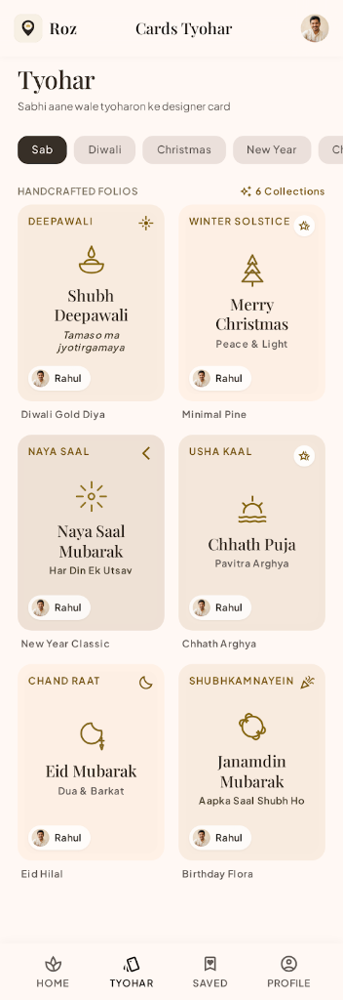
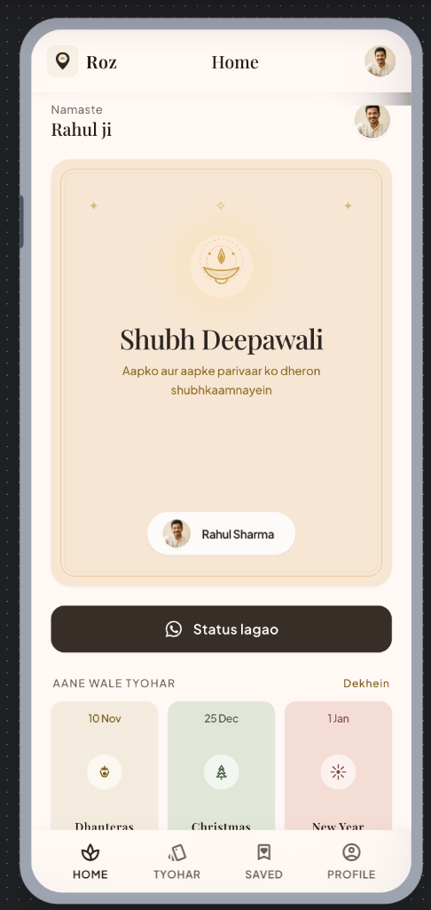
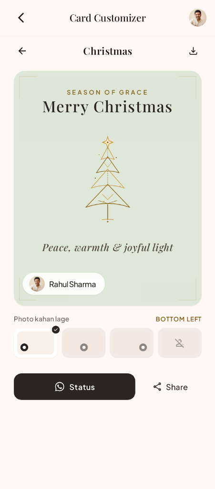
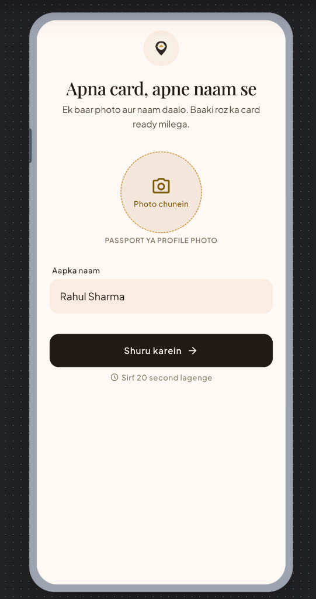
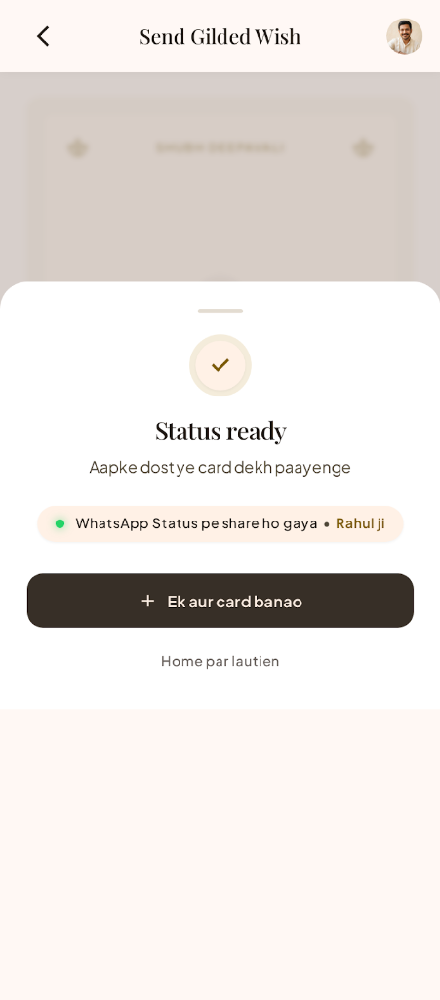

  

<h1 align="center">Mera Shehar</h1>

  <em>Apne photo aur naam ke saath tyohar ke card banao, aur Status par lagao.</em> 
  Personalised festival cards with your own photo and name, shared in one tap.

  
  
  
  

---

## About

Every festival, millions of us forward the same plain wishes. **Mera Shehar** makes them personal.

Add your photo and name once. From then on, every Diwali, Chhath, Christmas or New Year card is ready with **your face and your name already on it**. One tap and it goes to your WhatsApp Status, your groups, or any other app.

No sign-up. No editing. No design skills needed.

## Screenshots

> Design previews. The final app may differ slightly.

<table>
  <tr>
    <td align="center"></td>
    <td align="center"></td>
    <td align="center"></td>
    <td align="center"></td>
    <td align="center"></td>
  </tr>
  <tr>
    <td align="center"><b>Start</b> Photo and name, once</td>
    <td align="center"><b>Home</b> Today's card, ready</td>
    <td align="center"><b>Tyohar</b> Browse by festival</td>
    <td align="center"><b>Editor</b> Choose where you appear</td>
    <td align="center"><b>Share</b> Card ready for Status</td>
  </tr>
</table>

## How it works

1. **Set up in 20 seconds.** Add your photo and name. That's it.
2. **Pick a card.** Today's festival card is waiting on Home, or browse all festivals in Tyohar.
3. **Share in one tap.** Send it to WhatsApp Status, a group, or any app.

## Features

- **Personal cards, instantly.** Your photo and name are placed on every card for you.
- **Festival-first design.** Clean, premium cards for Diwali, Dhanteras, Chhath, Christmas, New Year and more.
- **Choose your look.** Place your photo bottom-left, centre, bottom-right, or show just your name.
- **One-tap sharing.** WhatsApp Status, groups, or any other app. Save the card to your gallery too.
- **Tyohar browser.** Browse cards by festival and see how they look with your own photo before you share.
- **Saved cards.** Keep your favourite designs one tap away.
- **Hindi and English.** Cards with Hindi (Devanagari) or English wishes.
- **Daily reminder (optional).** A gentle nudge when a new festival card is ready.
- **New designs, no app update.** New festival cards appear automatically.
- **Light and fast.** Made for everyday phones, with a calm, aesthetic look.
- **Free to use.** Supported by ads.

## Coming soon

Things we are working on or planning next. No dates promised, order may change.

**In progress**
- [ ] Photo cut-out style: stand on the card without your photo background

**Next**
- [ ] More festivals: Dhanteras, Bhai Dooj, Lohri, Makar Sankranti, Republic Day, Holi, Eid, Ram Navami and more
- [ ] Daily Good Morning and Suvichar cards
- [ ] Birthday and anniversary cards
- [ ] More card styles for every festival
- [ ] Regional languages

**Later**
- [ ] **For shops and small businesses:** your logo, shop name and offer on festival posters
- [ ] **Village and neighbourhood polls:** e.g. "Match khelna hai, team bulao" to gather a team nearby
- [ ] Premium template packs
- [ ] Invite friends and share your favourite cards together

Have an idea? See [Feedback](#feedback).

## Download

**Coming soon on Google Play.**

<!-- When live, replace with:

-->

## Feedback

Found a bug or have a festival you want to see? Open an [issue](../../issues) or write to us at **[YOUR EMAIL]**.

We are not accepting code contributions yet, but ideas and bug reports are very welcome.

## Legal

- [Privacy Policy](YOUR_PRIVACY_POLICY_URL)
- [Terms of Use](YOUR_TERMS_URL)

Mera Shehar is an independent app. WhatsApp is a trademark of its owner. This app is not affiliated with or endorsed by WhatsApp or Meta.

## License

The source code in this repository is released under the [MIT License](LICENSE).

The **Mera Shehar** name and logo and the **template artwork** (card backgrounds and designs) are the property of the author and are **not** covered by the MIT License. All rights reserved. Fonts used in the app are under their own open licences.

---

  Made with care in India. 
  Built with Flutter.

